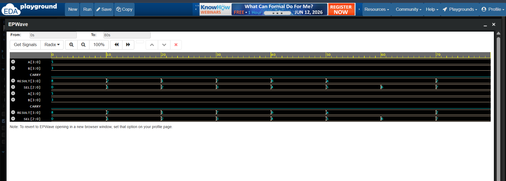

# ⚙️ 4-Bit Arithmetic Logic Unit (ALU) using Verilog HDL

> 🌟 A 4-Bit ALU designed using **Verilog HDL** to perform arithmetic, logical, and shift operations, verified using **EDA Playground** and **EPWave**.

---

## 📖 Overview

The Arithmetic Logic Unit (ALU) is one of the most fundamental building blocks of a processor.

This project implements an **8-operation 4-Bit ALU** capable of performing arithmetic, logical, and shift operations based on a 3-bit select input.

---

## ✨ Features

✅ Verilog HDL Implementation

✅ 4-Bit ALU Design

✅ 8 Different Operations

✅ Carry Output Support

✅ Functional Verification using EDA Playground

✅ Waveform Analysis using EPWave

✅ Professional GitHub Documentation

---

## 🏗️ Repository Structure

```text
Verilog-4Bit-ALU/
│
├── alu_4bit.v
├── alu_4bit_tb.v
├── alu_waveform.png
└── README.md
```

---

# ⚙️ Supported Operations

| SEL | Operation | Description |
|------|------------|-------------|
| 000 | ➕ Addition | A + B |
| 001 | ➖ Subtraction | A - B |
| 010 | 🔗 AND | A & B |
| 011 | 🔀 OR | A \| B |
| 100 | ✖️ XOR | A ^ B |
| 101 | 🚫 NOT | ~A |
| 110 | ⬅️ Left Shift | A << 1 |
| 111 | ➡️ Right Shift | A >> 1 |

---

# 🧠 Working Principle

The ALU uses a **3-bit select signal (SEL)** to determine which operation to perform.

```text
SEL
 ↓
Select Operation
 ↓
Generate RESULT
```

Only one operation is active at a time.

---

# 📥 Inputs and Outputs

## Inputs

| Signal | Width | Description |
|----------|--------|-------------|
| A | 4-bit | First Operand |
| B | 4-bit | Second Operand |
| SEL | 3-bit | Operation Selector |

---

## Outputs

| Signal | Width | Description |
|----------|--------|-------------|
| RESULT | 4-bit | Operation Result |
| CARRY | 1-bit | Carry Output |

---

# 🔍 Test Case Used

```text
A = 0101 (5)
B = 0011 (3)
```

---

# 📊 Verification Results

| SEL | Operation | RESULT | Decimal |
|------|------------|---------|----------|
| 000 | ➕ ADD | 1000 | 8 |
| 001 | ➖ SUB | 0010 | 2 |
| 010 | 🔗 AND | 0001 | 1 |
| 011 | 🔀 OR | 0111 | 7 |
| 100 | ✖️ XOR | 0110 | 6 |
| 101 | 🚫 NOT | 1010 | 10 |
| 110 | ⬅️ LEFT SHIFT | 1010 | 10 |
| 111 | ➡️ RIGHT SHIFT | 0010 | 2 |

---

# 📷 Simulation Waveform

The waveform below verifies all ALU operations.



---

# 🛠️ Tools Used

💻 Verilog HDL

🧪 EDA Playground

📈 EPWave

🌐 GitHub

---

# 🎯 Learning Outcomes

Through this project, I gained hands-on experience in:

🔹 Combinational Logic Design

🔹 Arithmetic Operations

🔹 Logical Operations

🔹 Shift Operations

🔹 Case Statements in Verilog

🔹 Carry Handling

🔹 Testbench Development

🔹 Functional Verification

🔹 Waveform Analysis

---

# 🚀 Future Enhancements

This ALU can be extended to support:

🧮 Multiplication

➗ Division

⚖️ Comparison Operations

🚩 Zero and Overflow Flags

🔢 8-Bit and 16-Bit ALUs

🖥️ Processor Integration

---

# 👩‍💻 Author

**Aneesa Pattan**

Electronics and Communication Engineering (ECE) Student

Aspiring VLSI & Digital Design Engineer 🚀

---

## ⭐ If you found this project interesting, consider starring the repository and connecting with me!

> *"Every processor begins with an ALU, and every engineer begins with curiosity."* 🌟
